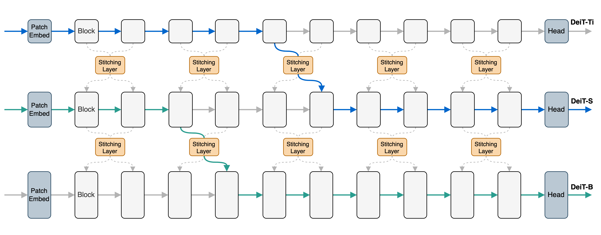

# Stitchable Neural Networks 🪡 (CVPR 2023 Highlight)

[](https://opensource.org/licenses/Apache-2.0) 
<a href="https://pytorch.org/get-started/locally/"></a>


This is the official PyTorch implementation of [Stitchable Neural Networks](https://arxiv.org/abs/2302.06586).


By [Zizheng Pan](https://scholar.google.com.au/citations?user=w_VMopoAAAAJ&hl=en), [Jianfei Cai](https://scholar.google.com/citations?user=N6czCoUAAAAJ&hl=en), and [Bohan Zhuang](https://scholar.google.com.au/citations?user=DFuDBBwAAAAJ).


## News

- 22/03/2023. SN-Net was selected as a highlight at CVPR 2023!🔥
- 02/03/2023. We release the source code! Any issues are welcomed!
- 28/02/2023. SN-Net was accepted by CVPR 2023! 🎉🎉🎉


## A Gentle Introduction



Stitchable Neural Network (SN-Net) is a novel scalable and efficient framework for model deployment which cheaply produces numerous networks with different complexity and performance trade-offs given a family of pretrained neural networks, which we call anchors. Specifically, SN-Net splits the anchors across the blocks/layers and then stitches them together with simple stitching layers to map the activations from one anchor to another.

With only a few epochs of training, SN-Net effectively interpolates between the performance of anchors with varying scales. At runtime, SN-Net can instantly adapt to dynamic resource constraints by switching the stitching positions. 


## Getting Started

SN-Net is a general framework. However, as different model families are trained differently, we use their own code for stitching experiments. In this repo, we provide examples for plain ViTs and hierarchical ViTs by stitching DeiT and Swin, respectively.

For DeiT-based experiments, please refer to [stitching_deit](./stitching_deit).

For Swin-based experiments, please refer to [stitching_swin](./stitching_swin).


## Citation

If you use SN-Net in your research, please consider the following BibTeX entry and giving us a star🌟!

```BibTeX
@inproceedings{pan2023snnet,
  title={Stitchable Neural Networks},
  author={Pan, Zizheng and Cai, Jianfei and Zhuang, Bohan},
  booktitle={CVPR},
  year={2023}
}
```


## Acknowledgement

This implementation is built upon [DeiT](https://github.com/facebookresearch/deit) and [Swin](https://github.com/microsoft/Swin-Transformer). We thank the authors for their released code.


## License

This repository is released under the Apache 2.0 license as found in the [LICENSE](https://github.com/ziplab/SN-Net/blob/main/LICENSE) file.

