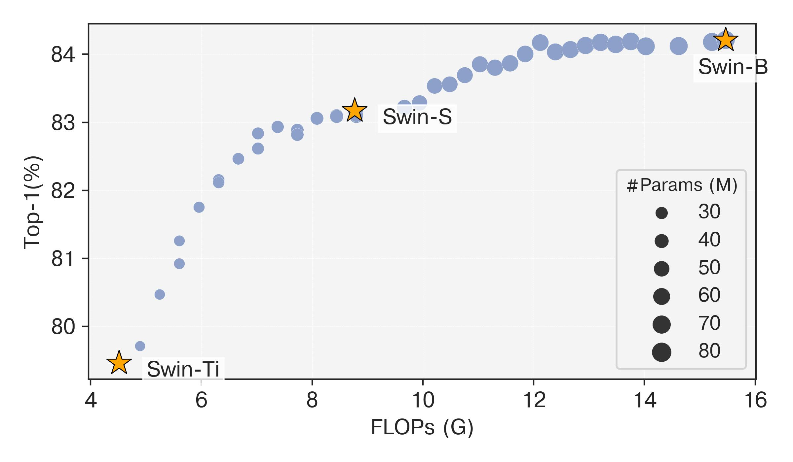

# Stitchable Neural Networks 🪡

This directory contains the training and evaluation scripts for stitching Swins.


## Requirements

### Prepare Python Environment
* PyTorch 1.10.1
* CUDA 11.1
* timm 0.6.12
* fvcore 0.1.5

For other requirements, please follow [Swin Transformer](https://github.com/microsoft/Swin-Transformer/blob/main/get_started.md) to prepare your virtual environment.


### Prepare Pretrained Weights

Download pretrained Swin-Ti, Swin-S, and Swin-B at [Swin model hub](https://github.com/microsoft/Swin-Transformer/blob/main/MODELHUB.md). Then, put them under the `pretrained` directory. The following commands can be helpful.
```bash
cd pretrained
wget https://github.com/SwinTransformer/storage/releases/download/v1.0.8/swin_tiny_patch4_window7_224_22kto1k_finetune.pth
wget https://github.com/SwinTransformer/storage/releases/download/v1.0.8/swin_small_patch4_window7_224_22kto1k_finetune.pth
wget https://github.com/SwinTransformer/storage/releases/download/v1.0.0/swin_base_patch4_window7_224_22kto1k.pth
```


## Training

Inside this directory, you can use the following commands to replicate our results on ImageNet.

```bash
python -m torch.distributed.launch --nproc_per_node 8 \
    --master_port 12345  main.py \
    --cfg configs/snnet/stitch_swin_ti_s_b.yaml
```

Make sure you update the ImageNet path in `configs/snnet/stitch_swin_ti_s_b.yaml`. By default, we train Swin-based SN-Net with 50 epochs. 


## Evaluation

You can download our trained weights from [here](https://github.com/ziplab/SN-Net/releases/download/v1.0/snnet_swin.pth). Next,


```bash
python -m torch.distributed.launch --nproc_per_node 8 \
    --master_port 12345  main.py \
    --cfg configs/snnet/stitch_swin_ti_s_b.yaml \
    --eval \
    --resume [path/to/snnet_swin.pth]
```

After evaluation, you can find a `stitches_res.txt` under the `outputs/[name]/default/` directory which contains the results for all stitches.


## Results

Our evaluation results of Swin-based SN-Net on ImageNet can be at `results/stitches_res.txt` . We also provide a script to visualize the FLOPs-accuracy curve of stitches, as shown  in Figure 6 of our paper.

```bash
python visualize_stitches.py
```

You should see a figure as below.




### Acknowledgement

This implementation is mainly based on [Swin](https://github.com/microsoft/Swin-Transformer). We thank the authors for their released code.
